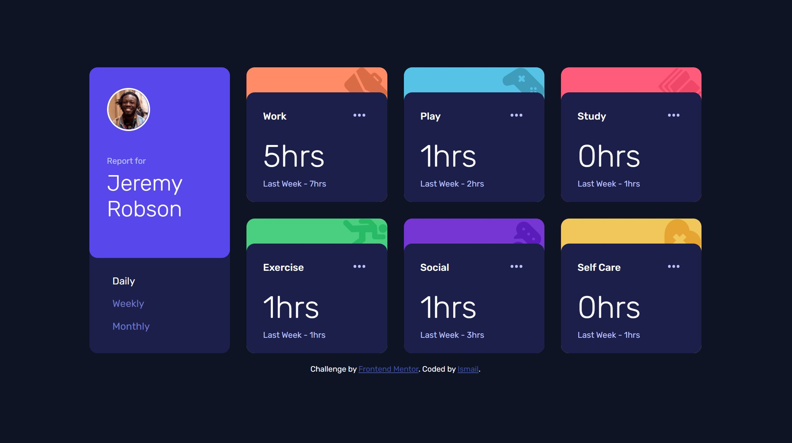

# Frontend Mentor - Time tracking dashboard

This is a solution to the [Time tracking dashboard challenge on Frontend Mentor](https://www.frontendmentor.io/challenges/time-tracking-dashboard-UIQ7167Jw). Frontend Mentor challenges help you improve your coding skills by building realistic projects.

## Table of contents

- [Overview](#overview)
  - [The challenge](#the-challenge)
  - [Screenshot](#screenshot)
  - [Links](#links)
- [My process](#my-process)
  - [Built with](#built-with)
  - [What I learned](#what-i-learned)
- [Author](#author)

## Overview

To create an interactive time tracking dashboard using css grid and javaScript as close to the design files provided.

### The challenge

Users should be able to:

- View the optimal layout for the site depending on their device's screen size
- See hover states for all interactive elements on the page
- Switch between viewing Daily, Weekly, and Monthly stats

### Screenshot



### Links

- Solution URL: [here](https://github.com/Ishi1834/time-tracking-dashboard)
- Live Site URL: [here](https://ishi1834.github.io/time-tracking-dashboard/)

### Built with

- Semantic HTML5 markup
- CSS custom properties
- Flexbox
- CSS Grid
- Vanilla JavaScript
- Mobile-first workflow

### What I learned

How to use an event listener to change css properties:

```js
daily.addEventListener("click", function () {
  //console.log("swith to daily");
  this.style.color = "white";
  weekly.style.color = "";
  monthly.style.color = "";
  switchTime("daily");
});
```

How to change html using javaScript:

```js
function switchTime(value) {
  var x = document.getElementsByClassName("thisWeek");
  var y = document.getElementsByClassName("lastWeek");
  for (let i = 0; i < x.length; i++) {
    //console.log(x[i]);
    //console.log(json[i].timeframes[value]);
    var current = json[i].timeframes[value].current;
    var previous = json[i].timeframes[value].previous;
    x[i].innerHTML = current + "hrs";
    y[i].innerHTML = "Last Week - " + previous + "hrs";
  }
}
```

## Author

- Github - [@Ishi1834](https://github.com/Ishi1834)
- Frontend Mentor - [@Ishi1834](https://www.frontendmentor.io/profile/Ishi1834)
- CodePen - [@sadiq1834](https://codepen.io/sadiq1834)
